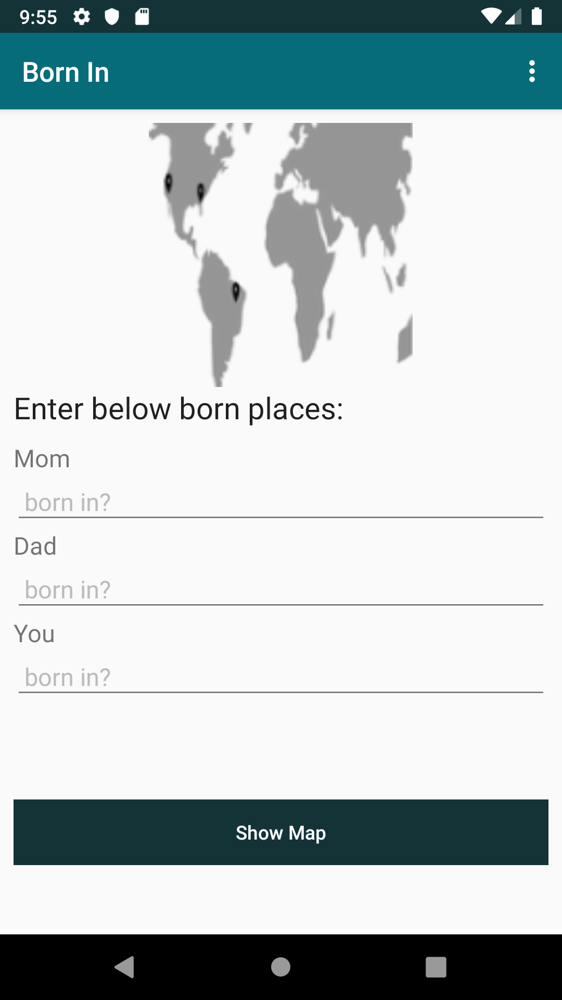
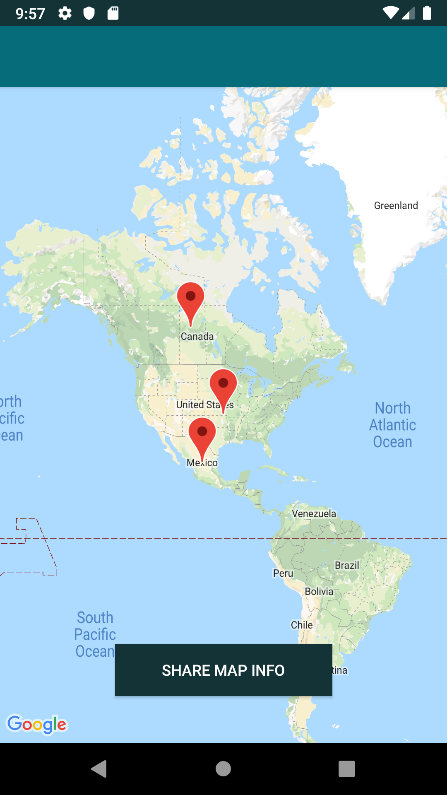

# KotlinLearningMap
[](https://sonarcloud.io/dashboard?id=AndreSand_BornInApp)


## Code
Using Android Studio 3.5 Beta 1, Kotlin, and gradle 4.10

- Google Maps API
- Kotlin and Anko
- Geocoder (gets lat and long location from address) example: val SF = LatLng(37.773972, -122.431297)

## Publish apk
1. In build.gradlew update versionCode and versionName
2. ```./gradlew clean build```
3. Generates signed apk (/app/build/outputs/apk/release)
4. Upload apk [Google Dev Console](https://play.google.com/apps/publish/)

## Demo

## Enter info:


## Map shows born locations:



## Resources
map kotlin tutorial:
https://www.mytrendin.com/draw-route-two-locations-google-maps-using-kotlin-android/

read about kotlin tests below:
https://github.com/pot8os/Kotlin-Espresso-sample
https://fernandocejas.com/2017/02/03/android-testing-with-kotlin/
https://github.com/android10/Android-KotlinInTests
https://www.youtube.com/watch?v=_f-qkGJBPts

common views:
https://drive.google.com/file/d/0B5XIkMkayHgRMVljUVIyZzNmQUU/view

screenshot and share:
http://www.androhub.com/take-a-screenshot-programmatically-in-android/

material colors:
https://material.io/guidelines/style/color.html#color-color-palette

## Publish to Beta, then promote to Beta -> [Release](https://play.google.com/apps/publish/?account=7285672962128655255#ManageReleasesPlace:p=com.bornin.androidapp)
Using gradle-play-publisher plugin:
1. update versionCode and versionName
2. $./gradlew publishApkRelease
[gradle-play-publisher](https://github.com/Triple-T/gradle-play-publisher#google-play-service-account)
[codepath tutorial](https://github.com/codepath/android_guides/wiki/Automating-Publishing-to-the-Play-Store)

Using fastlane
1. update versionCode and versionName
2. $fastlane alpha
[fastlane](https://medium.com/quark-works/how-i-increased-my-productivity-during-deployments-using-fastlane-9e30301f41ed)

## Testing: Integrate reporting with codecov.io
[codecov](https://codecov.io/gh/AndreSand/KotlinLearningMap)
upload token cf25376c-9432-4b0b-9989-5048288f8675

[testing tutorial](http://kuzzle.io/blog/2016/03/tips-to-use-travis-on-an-android-environment)

